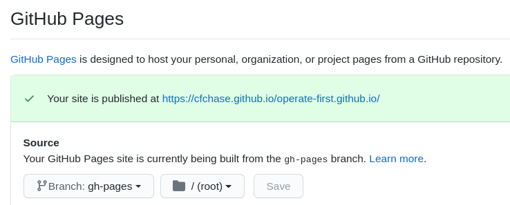

# Operate First Website

For more information regarding the purpose and roadmap, view the [website](https://operate-first.cloud/) or the [markdown doc](https://github.com/operate-first/operate-first.github.io/blob/master/content/index.md)

## Development / Contributing

Documentation can be added directly from the repository or from a remote repository.

## Adding a document / post

Files formatted as Markdown (`.md` file) or Jupyter notebook (`.ipynb`) can be added to this website. See below for instructions on how to add the files to the website.

1. Format the Markdown file as follows:

    ```markdown
    ---
    title: My Document
    description: My Document Description
    ---

    # Content goes here

    valid markdown
    ```

2. Jupyter Notebooks (`.ipynb`) can be added by creating an `notebook.mdx` file where you can import the notebook(s) to be included.

    Add an `notebook.mdx` file in the same directory where the notebook is being added.
    eg:

    `/notebooks/notebook.mdx`  
    `/notebooks/notebook.ipynb`  

    Format the `notebook.mdx` file as follows:

    ```markdown
    ---
    title: My Notebook
    description: My Notebook Description
    ---

    import JupyterNotebook from '../../../src/components/JupyterNotebook'

    ### Title

    <JupyterNotebook path="notebook.ipynb"/>
    ```

## Location of Content

Content will be added to one of the four categories on this website:

* **data-science**: Examples of data science projects for the data science users that want to learn about data science on ODH.
* **users**: Documentation for all users of ODH. Access details of various deploed ODH components.
* **operators**: Examples and documentation from operators of ODH. 
* **blueprints**: Generic information that can be applied to other projects as well.

Add content remotely(preferred) or locally to this repo.

### Remote Content

Prefer adding content remotely to this website wherever applicable (where the content exists on some Github repo). Remote content can be added from a Github repository. To add remote content to this website, it is recommended you clone any remote content repositories or forks as you prefer at the root of this repository:

```shell script
git clone git@github.com:operate-first/continuous-deployment.git
```
Include the remote repository to `.gitignore`.

Add remote repository url and directory to get content from in `content-sources.yaml`. 

Add the Git source where you are adding content from. Set the name of the repo, the root ad the `dir` and set the urlPrefix as the content category you are adding that content to (see the four categories mentioned above) and the name of the repository.

See example:

```yaml
- name: continuous delivery docs
  gitSrc: https://github.com/operate-first/continuous-delivery.git
  dir: continuous-delivery
  urlPrefix: blueprints/continuous-delivery
```

**If adding remote notebooks**, it's required to create an *.mdx file in your remote repository's `notebooks` folder for each notebook you want to render (this file is what actually gets displayed). We recommend the following naming convention `notebook-you-want-to-publish-name.mdx` .

It is also possible to render multiple notebooks within one .mdx file if needed. Create an single .mdx file within your repository's `notebooks` folder referencing the notebooks in the .mdx file as follows.

```markdown
---
title: My Notebook
description: My Notebook Description
---

import JupyterNotebook from '../../../src/components/JupyterNotebook'

### Title
<JupyterNotebook path="notebooks/notebook1.ipynb"/>
<JupyterNotebook path="notebooks/notebook2.ipynb"/>
...
...
```

The *.mdx files should follow the format outlined in the example above. However, depending on the directory structure of your repository the following path may need to be updated to navigate out of your cloned repo and into the correct `JupyterNotebook` directory.    

```
import JupyterNotebook from '../../../src/components/JupyterNotebook'
```

### Local Content

Local content can be added to a sub-folder in `content/category` one of the four categories mentioned above.

For example, to add content locally to the `blueprints` category, create an index.md located at `content/blueprints/content-name/index.md`.

### Configuring Table of Contents

Whether adding content remotely, or locally, the content needs to be added to the vertical navigation bar on the left and belongs to one of the four categories.

The `content` directory contains `category.yaml` files for each category eg: `blueprints.yaml` for the Blueprints category and this file will contain the table of content navigation items for each document that you add.

The (`.yaml`) config looks as follows:

```yaml
- id: repo-name
  label: Repo Name #Camel Cased without hyphens
  href: urlPrefix-from-content-sources/path-to-document-to-be-published
```
Following is an example of 2 level hierarchy from a repo, for cases where you have to add more than one document from a repository as remote content.

```yaml
- id: continuous-delivery
  label: Continuous Delivery
  links:
    - id: cicd_intro
      label: (Opinionated) Continuous Delivery
      href: /blueprints/continuous-delivery/docs/continuous_delivery
    - id: continuous-delivery-setup-source-operations
      label: Setting up Source Code Operations
      href: /blueprints/continuous-delivery/docs/setup_source_operations
```

## Local Development


You can run the app locally to preview your changes.
In terminal:

```shell script
make dev
```

If you have problems, run `make dev-clean`

### Previewing your changes on GitHub pages

When previewing your changes on a fork.

First, enable github pages to use the gh-pages branch from root.



Make sure to push your changes to your branch on the fork.

Then, from your branch manually build and push.

```shell script
make gh-pages-fork
```

Now you can view your work on `https://githubuserid.github.io/operate-first.github.io`

### Previewing multiple PRs on GitHub pages

If you've set up to preview the site on your personal GitHub pages, like the above, you can also preview multiple PR branches from your fork under separate paths. For example, for a branch named `my-branch`, would deploy under a subpath of the same name.

From your branch manually build and push.

```shell script
make gh-pages-branch
```

Now you can view your work on `https://githubuserid.github.io/operate-first.github.io/my-branch`

### Manual Site Deployment (Production GitHub Pages)

CI should deploy to GitHub pages automatically, but to manually redeploy

```shell script
make gh-pages
```

## Running on OpenShift

Customize your `.env` file similar to `.env.default`(.env.default)

#### Building a containerized image

Customize `.env` file to image and source information as desired. `npm` and the `s2i` command line tool is required. [https://github.com/openshift/source-to-image](https://github.com/openshift/source-to-image)

```.env
IMAGE_REPOSITORY=quay.io/my-org/operate-first-app:latest
SOURCE_REPOSITORY_URL=git@github.com:my-org/operate-first.github.io.git
SOURCE_REPOSITORY_REF=my-branch
```

```shell script
make build
```

#### Pushing the container image

Customize `.env` file to image information and container builder.

```.env
CONTAINER_BUILDER=docker
IMAGE_REPOSITORY=quay.io/my-org/odh-dashboard:latest
```

```shell script
make push
```

#### Deploying to OpenShift

Customize `.env` file for deployment information. Required. `oc` command line tool is required.

```.env
OC_URL=https://api.my-host:6443
OC_PROJECT=operate-first
# user and password login
OC_USER=kubeadmin
OC_PASSWORD=my_password
```

or

```.env
OC_URL=https://api.my-host:6443
OC_PROJECT=operate-first
# token login
OC_TOKEN=my_token
```

Run:

```shell script
make deploy
```
